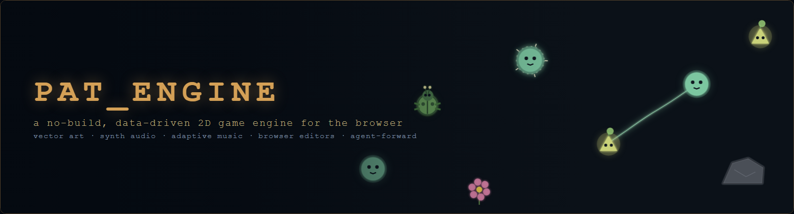
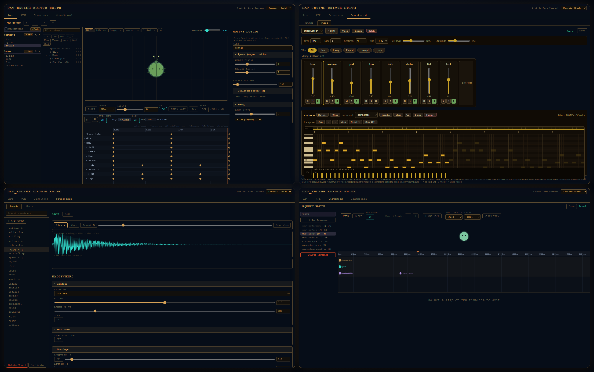
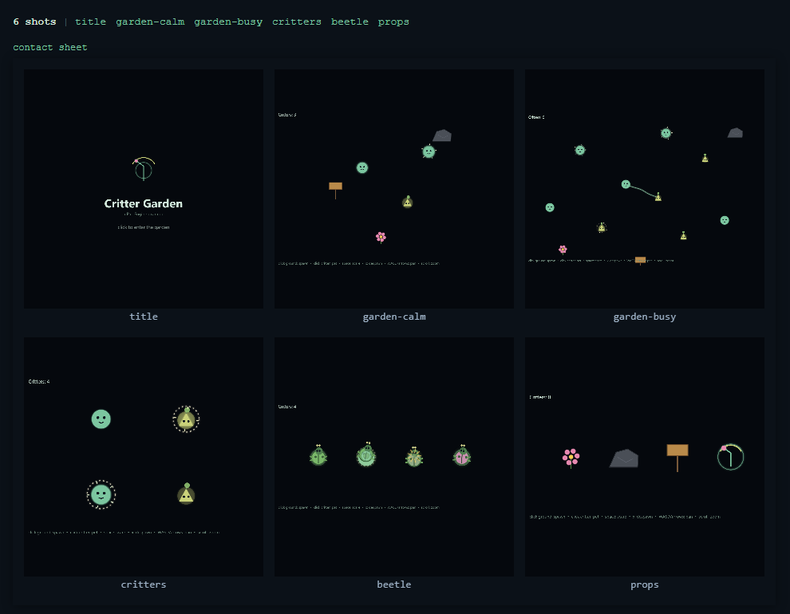
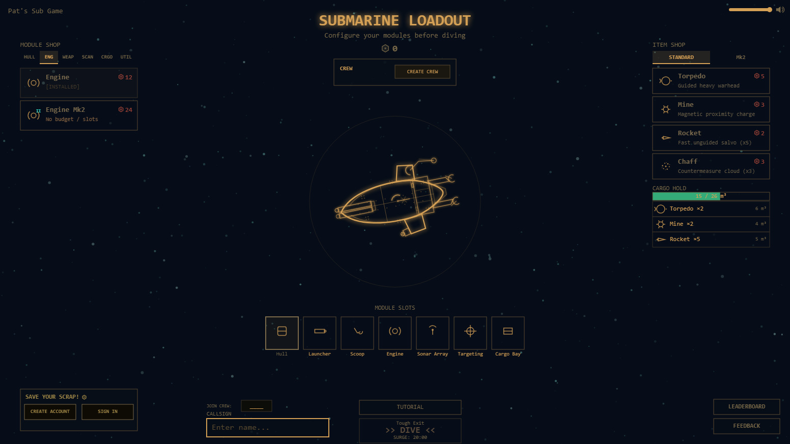
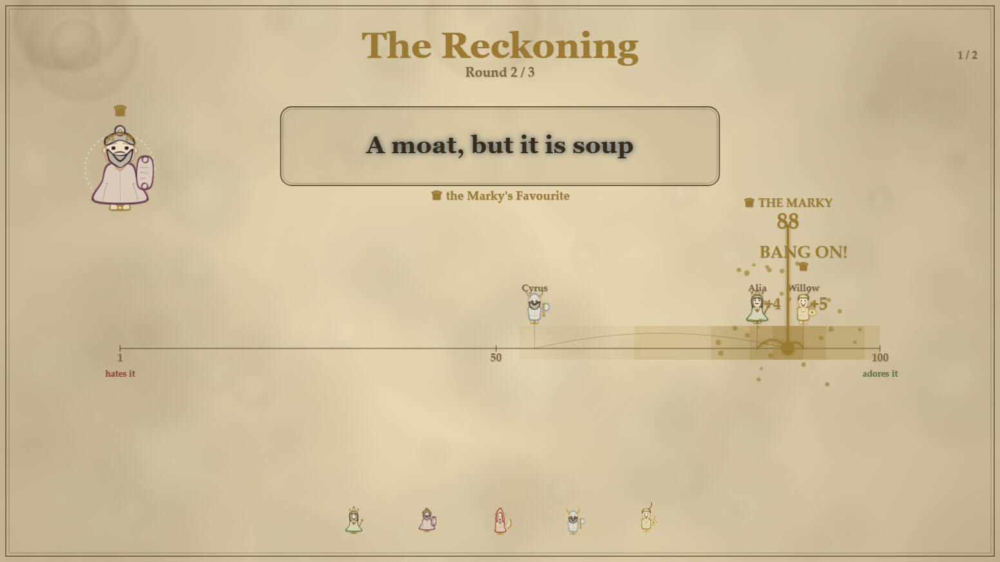
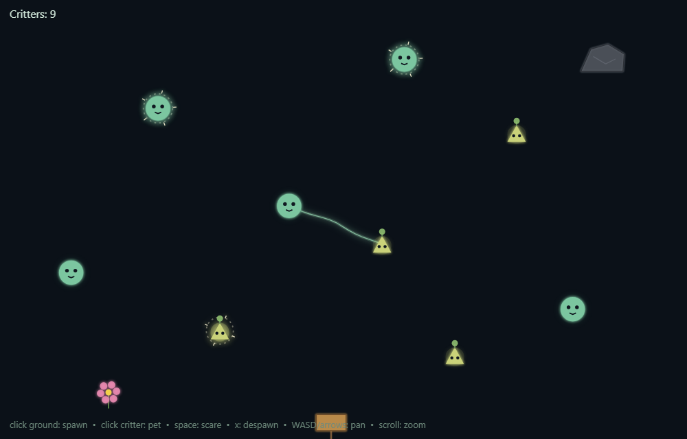

# Pat_Engine



> Hi, I'm Pat. I like to make fun little games for my own enjoyment and to share with my
> friends. After a few of these I started building tooling I could reuse for new ones,
> and polished those tools into this engine. It will keep evolving as I make more stuff.

A no-build 2D engine for the browser. Art is vector JSON drawn on Canvas2D, sound is
Web-Audio synthesis, music is JSON note patterns: a game's creative content is a folder
of data files, not a folder of binaries. Every format has a built-in browser editor, and
because it's all documented JSON, the engine is agent-forward: an AI coding agent can
author assets and gameplay the same way you do ([AGENTS.md](AGENTS.md) ships in the repo
for exactly that).



## Getting started

The engine isn't an npm dependency. There's no package to depend on and no version to
track: it's a small, readable runtime you copy into your project, and from then on it's
yours to edit.

You need three things installed, all of which you likely have:

- [Node.js](https://nodejs.org) 20.11 or newer (npm comes with it).
- git, to clone the repo.
- Any current browser. No build tools, no global installs.

Pull the repo and explore the example game first:

```sh
git clone https://github.com/prdoring/Pat_Engine.git
cd Pat_Engine
npm install          # installs the engine's one dependency (ws)
npm start
```

Or skip the manual steps and paste this into your coding agent (Claude Code, Cursor,
Codex, whatever you use):

```text
Clone https://github.com/prdoring/Pat_Engine.git, run npm install (needs Node 20.11+),
then npm start, and verify http://localhost:6970/ and http://localhost:6970/editor both
load with no console errors. Then read AGENTS.md at the repo root: it is the guide for
building games and assets on this engine.
```

- **Game:** <http://localhost:6970/>. Click the ground to spawn critters, click a
  critter to pet it, `space` to scare, `x` to despawn, `WASD`/arrows to pan, scroll to
  zoom.
- **Editor suite:** <http://localhost:6970/editor>. See the **[Editor Guide](docs/EDITORS.md)**.
- **Shot harness:** <http://localhost:6970/shots>. Renders predefined game states to
  images (see [Built for agents](#built-for-agents)).

```sh
npm test        # unit + parity tests (Node --test, no dev-dependencies)
npm run smoke   # boots every page in a headless system Chrome/Edge; fails on console errors
```

The smoke test uses whatever Chrome or Edge is already on your machine (set `BROWSER=/path/to/chrome`
to point it somewhere specific) and skips itself if it can't find one. Nothing extra to install.

When you're ready to build your own game, the scaffold script copies the engine baseline
(with the example game as a starting point) into a fresh folder, renames the package, and
inits git:

```sh
./new-game.sh MyGame              # creates ../MyGame next to the engine
./new-game.sh /path/to/MyGame     # or an explicit path
# flags: --no-install  --no-git  --force
```
```powershell
.\new-game.ps1 MyGame             # creates ..\MyGame next to the engine
.\new-game.ps1 C:\Games\MyGame    # or an explicit path
# flags: -NoInstall  -NoGit  -Force
```

Then make it yours:

1. Replace `data/*.json` with your own content (or author it in `/editor`).
2. Point `data/editor-manifest.json` at your art collections + preview entities.
3. Replace `game/` with your scenes and entities, wiring engine services in
   `game/main.js`.

See [AGENTS.md](AGENTS.md) §8 for the full new-game recipe.

## Vectors and synthesis, not asset folders

Pat_Engine avoids binary assets wherever it can. Art is JSON interpreted on a Canvas2D,
drawn live at any resolution and zoom; VFX are data, not sprite sheets; sound is
synthesized (sample files are supported but optional); music is JSON note patterns played
by synth instruments. A game's entire creative content ends up as a few human-readable
JSON files, so assets show up in pull requests as reviewable diffs, and anything that can
edit JSON can author them.

## Built for agents

Things in the repo that assume an agent may be doing some of the work:

- **[AGENTS.md](AGENTS.md):** the complete guide to the layering rules, the
  sequence-first orchestration pattern, signal callbacks, and every authoring schema.
  Scaffolded projects carry it along.
- **Data-first formats:** art, VFX, sound, music, and sequences are all documented
  JSON, so an agent can author or tune any asset by editing data. No image or audio
  tooling required.
- **The shot harness:** `data/shots.json` declares named game states and `/shots`
  renders them to real canvas images, so an agent can edit art or scene code, reload,
  and check the actual pixels (programmatically via `window.__shots`, or as a contact
  sheet of every state).



## Built with Pat_Engine

<table>
<tr>
<th align="left"><a href="https://patssubgame.com/">Sub Game</a></th>
<th align="left"><a href="https://marklikey.patssubgame.com/">Mark Likey</a></th>
</tr>
<tr>
<td width="50%">A multiplayer PVPVE extraction game: outfit a modular submarine, dive for salvage among NPC drones and rival crews, and get out before the surge. Crew mechanics let friends run one boat together.</td>
<td width="50%">A fantasy-themed Jackbox-style party game about knowing how well you can read your friends' likes: build a courtier, then guess how much the Marky adores each answer.</td>
</tr>
<tr>
<td></td>
<td></td>
</tr>
</table>

## What's in the box

- **Vector art:** Canvas2D art interpreter + editor (shapes, per-state overrides,
  keyframe animation).
- **VFX:** effects interpreter + editor (phased effects, particle clouds, trails,
  beams).
- **Sequences:** a runner + timeline editor that orchestrates sound, VFX, and
  game-state changes together from a single JSON definition.
- **Sound:** Web-Audio synth/sample engine + soundboard editor.
- **Music:** adaptive-music director (synchronized synth tracks crossfaded by
  intensity tier) + mixing-console editor with a live piano-roll MIDI editor and
  ABC/MIDI import.
- **Core:** game loop, scenes, camera (pan/zoom), parallax background, sprite/text
  caches, ship physics + collision.
- **Editor suite:** all of the above in one tabbed browser app with a file-based
  save/backup pipeline. See the **[Editor Guide](docs/EDITORS.md)**.
- **Critter Garden:** a tiny example game that exercises every subsystem except the
  optional net module. Its only binary assets are two small `.wav` samples and one
  `.mid` score:



## Networking (optional)

`engine/net/` is a client-server scaffold for multiplayer games, unused by the example.
It covers two shapes: **authoritative real-time** (a fixed-timestep `ServerLoop` on Node,
snapshot interpolation via `StateBuffer`, and a reconnecting `NetworkClient` in the
browser) and **room/party games** (`RoomServer`: short-code rooms, reconnect tokens, host
role, heartbeat, with your game logic injected per room). Message types are defined in
your game via `defineMessageTypes`; the single-player core has zero dependency on the
module. Wiring sketches for both shapes: [engine/net/README.md](engine/net/README.md).

## Configuration (env vars)

- `PORT`: HTTP port (default `6970`).
- `HOST`: bind address (default `127.0.0.1`, loopback only). Set `HOST=0.0.0.0` to
  expose on the LAN.
- `EDITOR_PASSWORD`: when set, the `/editor` suite and the editor write APIs require
  login. Unset by default (open), which is safe because the server binds localhost only
  unless you change `HOST`.

The save API only writes allowlisted data files and keeps rotated backups under
`data/.backups/` (details in the [Editor Guide](docs/EDITORS.md)).

## Layout

```
engine/   game-agnostic runtime (render, audio, fx, physics, core loop, optional net). No game code in here, ever.
editors/  game-agnostic editor suite, driven by data/editor-manifest.json.
data/     project content: art/vfx/sfx/music/sequence JSON + the manifest. Edited by the editors.
game/     the game: scenes, entities, bootstrap. The only place you write gameplay code.
server/   the host: static serving + editor save API.
assets/   binary assets (SFX samples + MIDI scores).
docs/     the editor guide + screenshots.
```

The one hard rule: **the engine never knows what game it runs.** `engine/` and `editors/`
contain no game nouns; games talk to the engine through data and injected services.

## Documentation

| Doc | What it covers |
|---|---|
| [docs/EDITORS.md](docs/EDITORS.md) | User guide to every editor tool, with screenshots |
| [ENGINE.md](ENGINE.md) | Terse architecture + API cheat-sheet for the runtime |
| [AGENTS.md](AGENTS.md) | The full guide to building a game on this engine. Written for AI coding agents, useful to anyone. |
| [engine/net/README.md](engine/net/README.md) | The optional multiplayer module + wiring sketches |

## License

[MIT](LICENSE)
