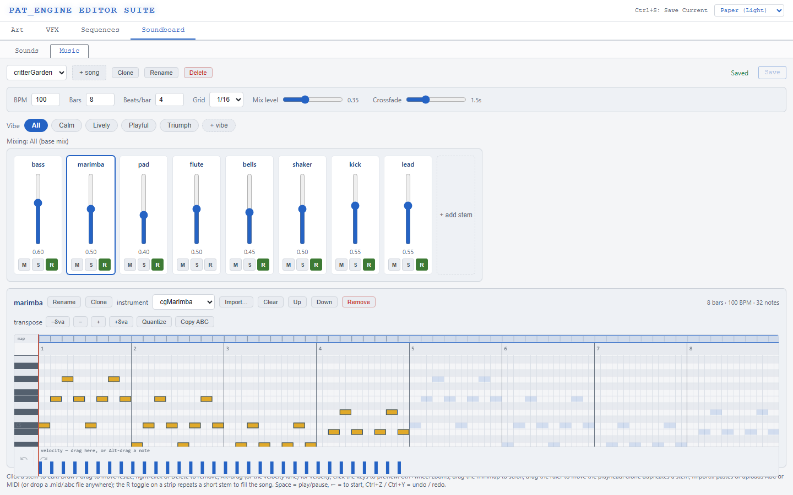
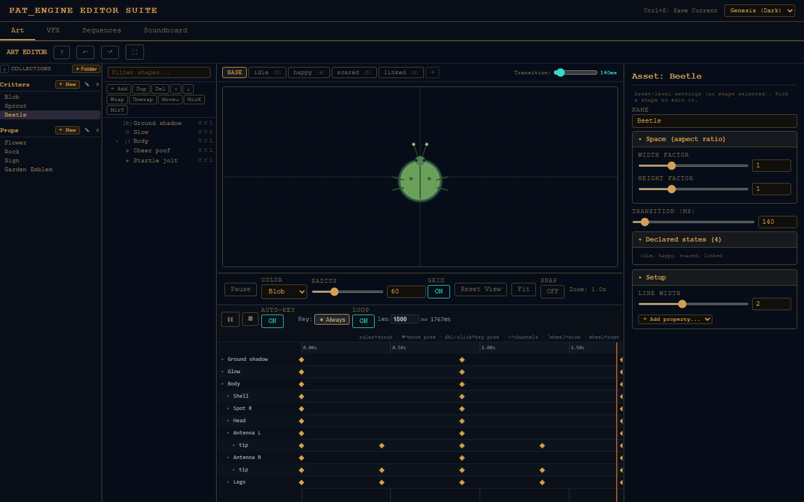
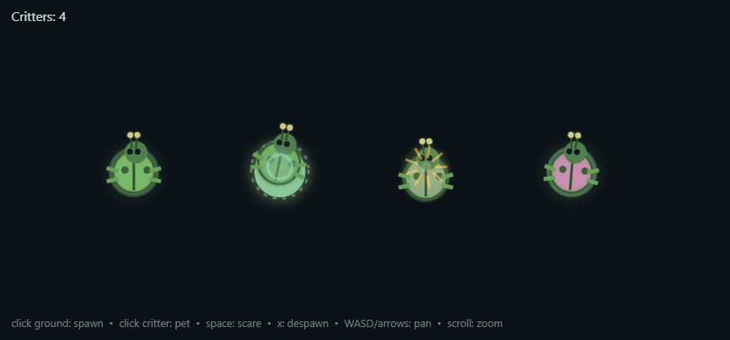
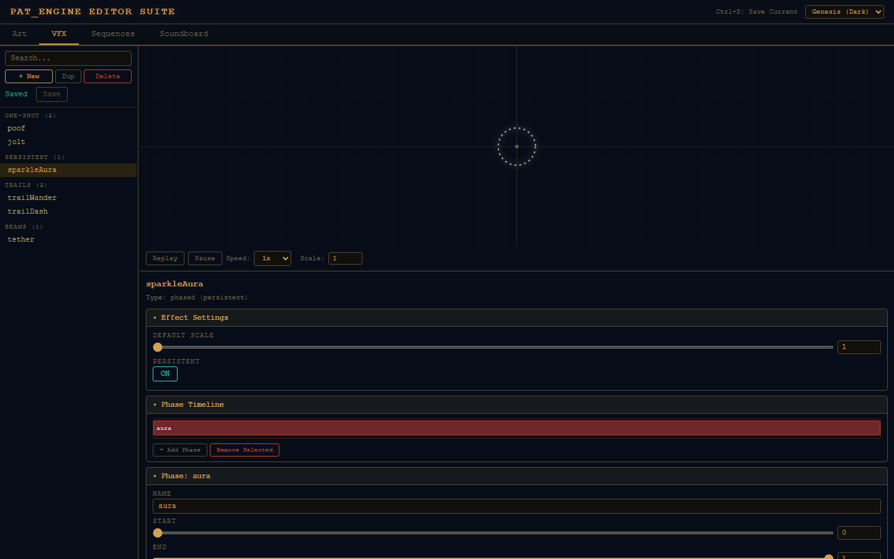
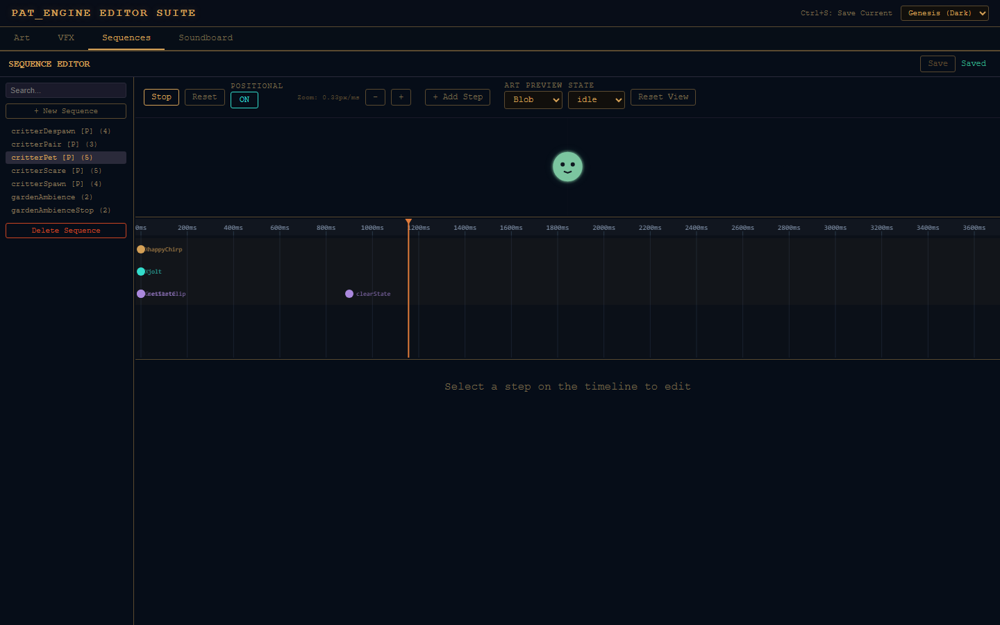
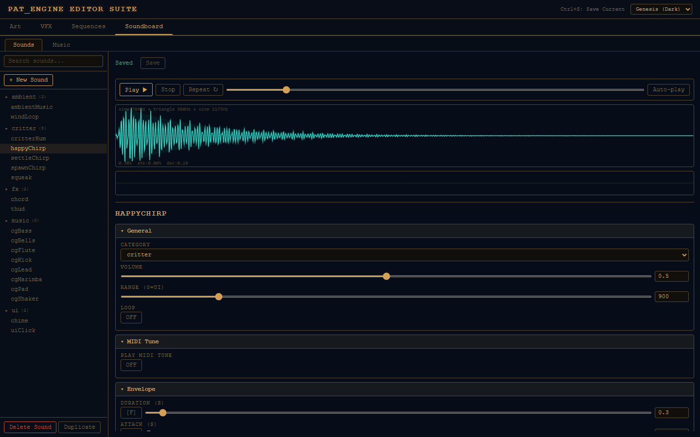
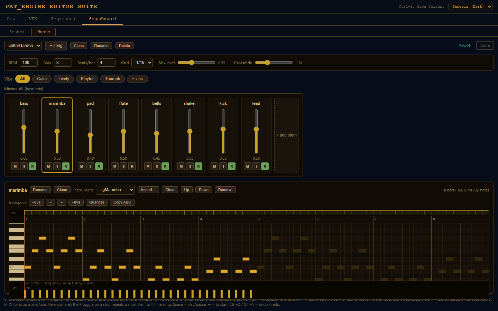

# Pat_Engine Editor Guide

Pat_Engine ships a browser-based editor suite for all of its data-driven content. Run
`npm start` and open **<http://localhost:6970/editor>**. Everything you author lands in
`data/*.json`, the same files the game imports at runtime, so there is no export step:
saving in the editor is publishing to the game.

The suite has four tabs (**Art**, **VFX**, **Sequences**, and **Soundboard**, which hosts
**Sounds** and **Music** sub-tabs).

## Suite basics

`Ctrl+S` saves the active tab (tabs with unsaved changes show a red dot, and the browser
warns before closing with unsaved work). `Ctrl+1`…`Ctrl+4` switch tabs. The header picker
sets the editor theme (Genesis dark, Slate dark, High Contrast, Daylight, or Paper
light); the choice persists per browser:

- **Save pipeline:** saves go through `POST /api/save-data`, which only accepts an
  allowlist of data files (the core creative JSON plus every art collection listed in
  the manifest) and writes a timestamped backup to `data/.backups/` (rotated, never
  served over HTTP). Login is controlled by the `EDITOR_PASSWORD` env var; see the
  README's Configuration section.
- **Retargeting:** the editors read `data/editor-manifest.json`; point it at your own
  files and the same editors edit your game
  ([how](#using-the-editors-for-your-own-game)).

---

## Art editor

Declarative vector art: assets are JSON shape lists interpreted by the engine's Canvas2D
art interpreter, with per-state overrides and keyframe animation on top.

**Layout, left to right:**

- **Collections sidebar:** one section per art collection from the manifest (here
  *Critters* and *Props*). `+ New` creates an asset; hovering an entry reveals rename,
  duplicate, and delete.
- **Shape tree:** the asset's shape hierarchy (groups nest). Toolbar buttons add,
  duplicate, delete, wrap/unwrap groups, reorder, and mirror shapes. Per-node
  hide/solo/lock toggles keep complex assets manageable.
- **Preview canvas:** a live render of the asset. Click to select shapes, drag to move
  them, and grab vertex/radius handles to reshape. Arrow keys nudge; `Ctrl+C`/`Ctrl+V`
  copy/paste shapes; `Ctrl+Z`/`Ctrl+Shift+Z` (or `Ctrl+Y`) undo/redo. The toolbar under
  the canvas sets the preview color/radius, grid, snap, and zoom.
- **Properties panel:** every property of the selected shape (colors, coordinates,
  stroke, alpha, …). Select nothing to edit asset-level settings (name, aspect-ratio
  space, transition duration, declared states). Coordinate fields show a live "= N px"
  readout of their resolved value.

### States

The **state bar** above the canvas lists the asset's states (`BASE`, `idle`, `happy`, …).
Pick a state and edit: changes are recorded as *state overrides* on top of the base
shape rather than mutations of it (overridden properties are marked, and can be removed
individually). `visibleStates` on a shape shows/hides it per state, and the game
crossfades between states over the asset's transition duration.

The example project's beetle exercises the whole system: four states plus layered
keyframe animation.

### Keyframe animation

The bottom panel is a **part-centric dope sheet** (a keyframe timeline): one row per
shape (part), not per property. A diamond means that part has at least one keyed property
at that time, which the editor calls a *pose*.

- **Auto-key is on by default**: scrub the playhead, tweak the part (in the panel or by
  dragging on the canvas), and a keyframe is written at that time. Property widgets are
  time-aware: they show the value *sampled at the playhead*, so an edit means "make it
  look like this, here."
- Drag a diamond to retime a pose, right-click to delete it, double-click a row to key
  the current pose at that time.
- Expand a row's `▸` for per-property channel sub-rows and fine control; the *Advanced
  channels* disclosure adds per-property key/loop/clear and a guided looping-motion
  generator.
- Each state gets its own animation **clip** (the timeline you're editing). The `*` clip
  plays under every state; a looping clip runs on absolute time; a `loop:false` clip
  plays once from state entry and holds.
- Transport: `Space` play/pause, drag the ruler to scrub, `Ctrl`/`Shift`+wheel to
  zoom/pan.

### Embedding VFX in art

An `effectRef` shape embeds a persistent VFX effect (authored in the VFX tab) inside an
art asset: auras, sparkles, particle clouds. Gate it per state with `visibleStates`.

---

## VFX editor

Data-driven effects: phased one-shot or persistent effects, trails, and beams.

- **Sidebar:** effects grouped by the manifest's `vfxCategories` (substring match on the
  effect id). `+ New`, `Dup`, and `Delete` manage effects.
- **Preview:** plays the selected effect on loop. `Replay`, `Pause`, playback speed, and
  scale controls sit under the canvas.
- **Effect settings** are type-specific. A `phased` effect is a list of time-windowed
  **phases**, each with **layers** of drawing primitives (`filledCircle`,
  `gradientCircle`, `strokeRing`, `dashedRing`, `spikeLines`, and the randomized-cloud
  `scatterDots`/`scatterLines`/`scatterStrips`). Trails and beams have their own fields.
- Most numeric fields accept animated value forms: a static number, `{from, to}`,
  `{from, to, modulate}`, or `{base, amplitude, freq}` for persistent oscillation.
- Mark an effect `persistent` to make it loop until removed; that's what `effectRef`
  shapes in art reference.

---

## Sequences editor

Sequences are the engine's orchestration layer: one JSON definition that fires sound,
VFX, and game-state changes together on a timeline. Game code triggers the whole
reaction with a single `sequences.play(id, { x, y, entity })`.

- **Sidebar:** all sequences in `data/fx-sequences.json`. `[P]` marks positional
  sequences (they play at an `{x, y}` world position, so their sounds attenuate with
  distance); the number is the step count.
- **Timeline:** one dot per step at its delay. Click a step to edit its type, timing,
  and payload in the panel below; `+ Add Step` appends one; zoom controls adjust the
  time scale.
- **Step types**: `sfx` (play a sound), `vfx` (spawn an effect), `loopStart`/`loopStop`
  (start/stop a persistent *sound* loop bound to an entity), and `signal` (invoke the
  game's `onSignal` callback, the seam through which a sequence changes game state,
  e.g. `setState`/`clearState`/`removeEntity`).
- **Art preview:** pick a preview entity (from the manifest) and press `Play` to watch
  the sequence run against real art: sounds play, effects spawn, and `signal` steps
  drive the preview entity's state exactly as they would in-game.

---

## Soundboard: Sounds

A synth-based sound designer for `data/sfx.json`. No audio files required (though sample
layers are supported): sounds are Web Audio synth definitions rendered at runtime.

- **Sidebar:** sounds grouped by category. `+ New Sound`, `Duplicate`, and
  `Delete Sound` manage the library.
- **Transport:** `Play`, `Stop`, `Repeat`, and `Auto-play` (replays on every edit, handy
  for tuning). The waveform panel plots the synth definition; a live meter below it shows
  the actual output while playing.
- **General:** category, volume, positional `range` (`0` makes it a UI sound with no
  world position), and `loop`.
- **Synth:** one or more layers (`sine`, `square`, `sawtooth`, `triangle`, `noise`, or a
  `file` sample), an envelope (duration/attack/decay), and per-sound `LFO`, `reverb`,
  `vibrato` (pitch LFO), a biquad tone `filter`, and `distortion`.
- **Randomization:** every scalar synth field has an `[R]` toggle that turns it into a
  `[min, max]` range, re-rolled on each trigger so repeated sounds don't feel stamped.
- **MIDI tune:** a sound can render a `.mid` score through its voice (`synth.midi`),
  which is also how music stems get their timbre.

---

## Soundboard: Music

A mixing console and piano-roll MIDI editor for `data/music.json`, the engine's adaptive
music system: a song is a set of synchronized looping instrument tracks ("stems") whose
gains crossfade by intensity tier, with no restarts.

- The top bar holds the song picker (`+ song`, `Clone`, `Rename`, `Delete`) and the song
  settings: BPM, bars, beats/bar, the piano-roll snap grid, the master mix level, and the
  crossfade the game uses when switching vibes.
- **Vibes:** intensity tiers (`calm`, `lively`, `playful`, `triumph`, …). Each vibe maps
  stem → gain; select one to edit its per-stem faders, and the game crossfades between
  vibes at runtime (`music.setIntensity('triumph')`). *All* shows the base mix.
- **Stem strips:** one fader per stem with **M**ute, **S**olo, and **R**epeat (tile a
  short pattern to fill the song on whole-bar periods). Add, remove, reorder, rename, and
  clone stems; each stem's *instrument* is a sound from the Sounds tab.
- **Piano roll:** click a stem to edit its notes. Draw to add, drag to move/resize,
  right-click (or `Delete`) to remove, `Alt`-drag or use the velocity lane for velocity,
  and click the piano keys to audition pitches. `Ctrl`+wheel zooms, the minimap scrolls,
  and dragging the ruler moves the playhead. Toolbar: transpose (`±` and `±8va`),
  `Quantize`, and `Copy ABC`.
- **Import:** paste or upload **ABC notation** or a **MIDI file** via `Import…`, or just
  drag-drop a `.mid`/`.abc` file onto the editor. Imports longer than the song
  auto-extend its bars.
- **Live audition:** the song plays through the real `MusicDirector` while you edit.
  Note edits, instrument swaps, and vibe changes swap in without restarting playback, in
  sync. `Space` play/pause, `←` to start, `Ctrl+Z`/`Ctrl+Y` undo/redo.

---

## Using the editors for your own game

The editors never hardcode project content; they read `data/editor-manifest.json`:

- `artCollections`: `{ id, label, file, collectionKey }` per art JSON file.
- `previewEntities`: the entities the Art and Sequences editors can preview
  (`{ id, label, artCollection, artId, radius, color, states }`).
- `vfxCategories`: sidebar grouping rules (`{ id, label, match: [substrings] }`).

Collections listed in the manifest become editable and saveable automatically. The
Soundboard and Music editors always edit `data/sfx.json` and `data/music.json` directly,
so they need no retargeting at all.

See [`AGENTS.md`](../AGENTS.md) for the full authoring schemas and engine architecture,
and [`ENGINE.md`](../ENGINE.md) for the runtime API cheat-sheet.
